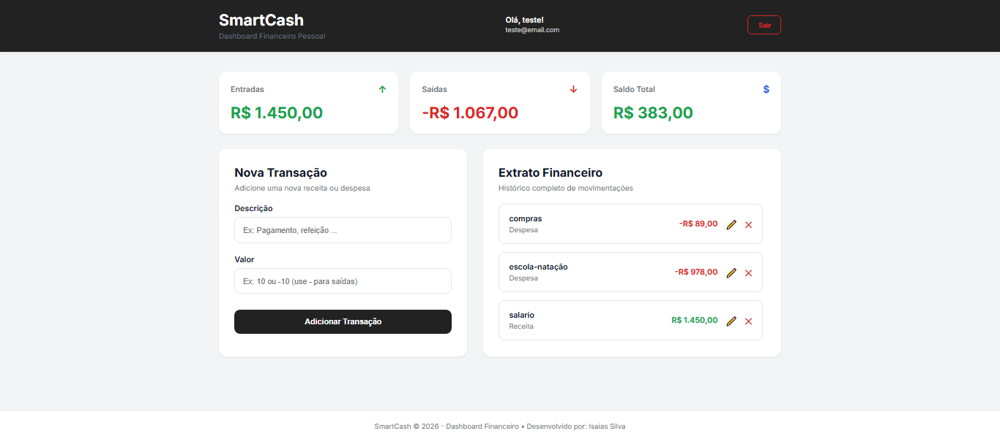

# 🚀 ConnectHub — Plataforma de Gestão Financeira com Autenticação

O ConnectHub é uma aplicação web full stack desenvolvida como parte da formação TrendsIT 2026, uma realização do Núcleo Softex Campinas e coordenação do Softex Nacional.

O projeto simula uma solução real de mercado para gerenciamento financeiro, combinando autenticação segura, persistência em banco de dados SQL e CRUD completo de transações.

---

## 🌐 Acesse o Projeto

🔗 Frontend: 

🔗 Backend/API: 

---

## 📁 Repositório

🔗 https://github.com/isaias30silva/ConnectHub_Fullstack_TrendsIT

---

## 🎯 Objetivo do Projeto

- Cadastro de usuários
- Login seguro com JWT
- Proteção de rotas privadas
- CRUD completo de transações
- Persistência em banco SQL
- Dashboard financeiro dinâmico
- Responsividade para desktop e mobile

---

## 🚀 Tecnologias Utilizadas

### Frontend
- HTML5
- CSS3
- JavaScript Vanilla

### Backend
- Node.js
- Express.js

### Banco de Dados
- MySQL
- Sequelize ORM

### Segurança
- JWT
- bcryptjs
- Variáveis de ambiente (.env)

---

## 📱 Funcionalidades

### 👤 Autenticação
- Cadastro de usuários
- Login
- Logout
- Validação de token
- Proteção de rotas

### 💰 Gestão Financeira
- Criar transações
- Listar transações
- Editar transações
- Excluir transações

### 📊 Dashboard
- Total de receitas
- Total de despesas
- Saldo atualizado automaticamente

---

## 🛡️ Segurança

- Senhas criptografadas com bcrypt
- Autenticação JWT
- Rotas protegidas
- Variáveis sensíveis em .env

---

## 📂 Estrutura do Projeto

```bash
connecthub/
│
├── backend/
│   ├── src/
│   │   ├── controllers/
│   │   ├── routes/
│   │   ├── middlewares/
│   │   ├── config/
│   │   └── app.js
│   │
│   ├── models/
│   ├── migrations/
│   └── server.js
│
├── frontend/
│   ├── index.html
│   ├── css/
│   ├── js/
│   └── assets/
│
└── README.md
```

---

## 🔄 Fluxo da Aplicação

```text
Usuário realiza login
        ↓
JWT é gerado
        ↓
Token armazenado
        ↓
Requisições autenticadas
        ↓
CRUD de transações
        ↓
Persistência em banco SQL
        ↓
Atualização do dashboard
```

---

## 📊 Operações Disponíveis

| Operação | Status |
|----------|---------|
| Cadastro de Usuário | ✅ |
| Login | ✅ |
| Logout | ✅ |
| Create | ✅ |
| Read | ✅ |
| Update | ✅ |
| Delete | ✅ |

---

## 🧪 Validações

- Nome obrigatório
- Email válido
- Senha mínima
- Valor obrigatório
- Valor diferente de zero

---

## 📱 Responsividade

Compatível com:

- Desktop
- Notebook
- Tablet
- Smartphone

---

## 📚 Aprendizados

- HTML semântico
- CSS responsivo
- JavaScript Vanilla
- APIs REST
- JWT
- Sequelize
- MySQL
- Arquitetura MVC
- CRUD completo
- Integração Frontend + Backend

---

## ⚙️ Como Executar Localmente

### Backend

```bash
cd backend

npm install

npm run dev
```

Crie um arquivo `.env`:

```env
PORT=3000

JWT_SECRET=sua_chave_secreta

DB_HOST=localhost
DB_PORT=3306
DB_NAME=connecthub
DB_USER=root
DB_PASSWORD=senha
```

Execute as migrations:

```bash
npx sequelize-cli db:migrate
```

### Frontend

Abra o arquivo:

```bash
frontend/index.html
```

ou utilize:

```bash
Live Server
```

---

## 📌 Requisitos Atendidos

✔ Cadastro de usuários

✔ Login com autenticação JWT

✔ Proteção de rotas

✔ CRUD completo

✔ Persistência em banco SQL

✔ Criptografia de senhas

✔ Responsividade

✔ Integração frontend/backend

✔ Arquitetura MVC

✔ Tratamento de erros

✔ Validações de formulário

---

## 👀 Preview

Adicione uma imagem:

```text
frontend/assets/images/preview.png
```

```md

```

---

## 👨‍💻 Autor

**Isaias Silva**

Estudante de Engenharia de Computação e participante do programa TrendsIT 2026.

---

## 📄 Licença

Projeto desenvolvido para fins educacionais e de aprendizado.
